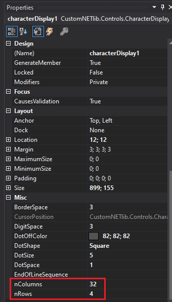
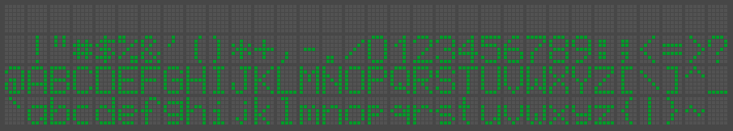

# Character Display

> There is no detailed reference manual available yet. But the Demo project will help you.

## Change The Size

Use the `nColumns` and `nRows` properties instead of the `Size` property to change the size of the display.

## Different Color Schemes

At the time there are three schemes available:
* `GreenOnGray`
* `WhiteOnBlue`
* `Windows` (default `Control...` colors)

With the attributes `BackColor`, `ForeColor` and `DotOffColor` you can define your own color schemes.

ASCII field of the default charset (color scheme: `GreenOnGray`):

Just a sample (color scheme: `WhiteOnBlue`):

## Add Characters To The Charset

With the `SetCharset` method you can overwrite the dotmatrix of a specified UTF-16 character. Use the _Dotmatrix_Character_Designer.xlsx_ to generate the correct `byte` array for the dotmatrix.
