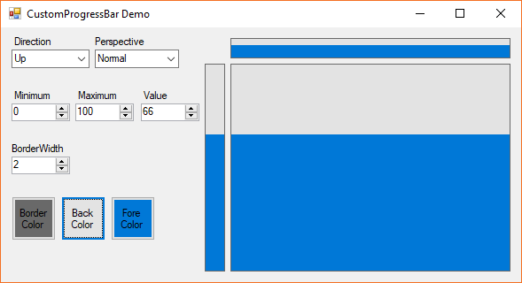
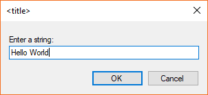
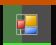

# Custom .NET Library

This library is a collection of some .NET components I created during my application developments.

---

## Components
### **CharacterDisplay**
A well customizable text control designed as a character display.

Namespace: `CustomNETlib.Controls.CharacterDisplay`

### **CustomProgressBar**
A progress bar similar to the standard one, but with the ability to set the direction.

Namespace: `CustomNETlib.Controls.CustomProgressBar`

### **InputDialog**
Prompts for an user input in a dialog window.

Namespace: `CustomNETlib.Dialogs.InputDialog`

### **IniFile**
Handler/parser for ini-files. Can handle files with `[sections]` and files without.

> Comments and blank lines of existing files will be totally ignored and get lost.

Namespace: `CustomNETlib.IO.IniFile`

### **TaskbarProgressBar**
Lets you control the progress bar on the taskbar icon of your application.

Namespace: `CustomNETlib.Windows.TaskbarProgressBar`

---

## Import a DLL to a Visual Studio Project
### Add a DLL to the References
1. Right-click on References in the Solution Explorer
2. Select *Add References…*
3. Browse to the DLL

### Add Controls of a DLL to the Toolbox
1. Right-click in the Toolbox
2. Select *Choose Items…*
3. Browse to the DLL
4. Check the controls, which should be displayed in the Toolbox
